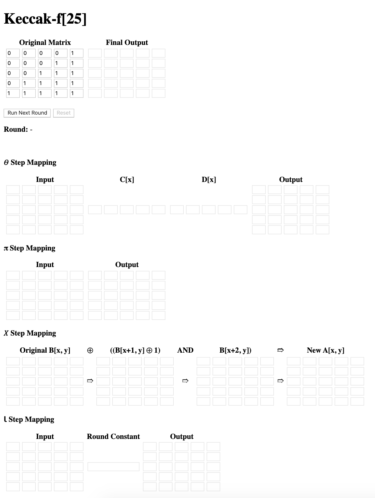
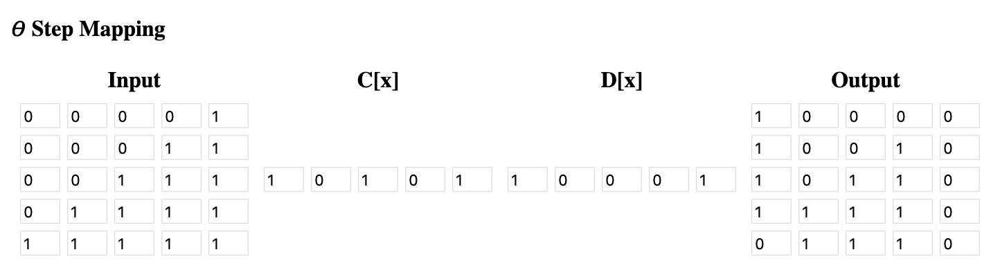

# Keccak And ElGamal
**by Jing Li s3676458**

## Introduction

This project creates demonstrations of SHA-3 hash algorithm and ElGamal cryptographic system. 

For the SHA-3, the project uses the simple Keccak f-25 with 12 rounds and for each round illustrates the inputs and outputs of the four round functions — Theta, Pi, Chi, and Iota.

The ElGamal part, it shows the generation of public and private key pair, the message encryption and decryption, and also the homomorphic property of the algorithm.

## Keccak f-25

### Overview

The user interface of the Keccak f-25 demo is as follows:

In the above image, the input is a 5 x 5 binary matrix (**Original Matrix**) and the final output is another 5 x 5 binary matrix (**Final Output**), which is the hashed value after 12 rounds of step mappings. Once the user clicks the **Run Next Round** button, it will take as input the output of the iota step from the last round, or the original input if it's the first round, and then run through four step mappings for substitution and permutation.

The state matrix can be represented as `A[x,y]` where `x` is the column and `y` is the row, and the origin `A[0,0]` is at the lower left corner. It's worth noting that for Keccak f-25, the state only has **one** slice, which means there is only one value on the `z` axis, thus we don't need to take `z` into account in the step mappings.

### Theta Step

In the Theta step, we first need to calculate the column parity `C[x]`for each column in the slice by **XOR'ing** all elements in column `x`.

In total, we have five values for the column parity `C[x]`. Then we need to apply the Theta effect for each column parity by **XOR'ing** its two adjacent bit values cycling from end to head, i.e., `D[x] = C[x-1] XOR C[x+1]`. In the end, another bitwise XOR operation needs to be performed to return the output of the Theta function — `A'[x,y] = A[x,y] XOR D[x]`.

### Pi Step

### Iota Step

## ElGamal Cryptographic System

### Overview

### Key Generation

### Encryption and Decryption

### Multiplication Over Encrypted Data

