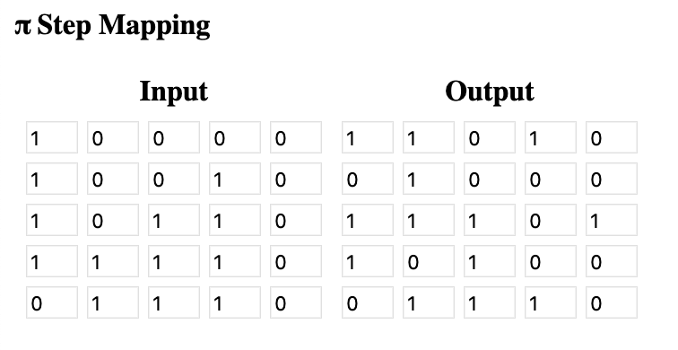
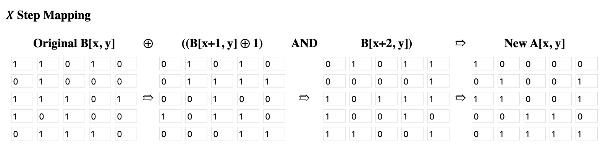
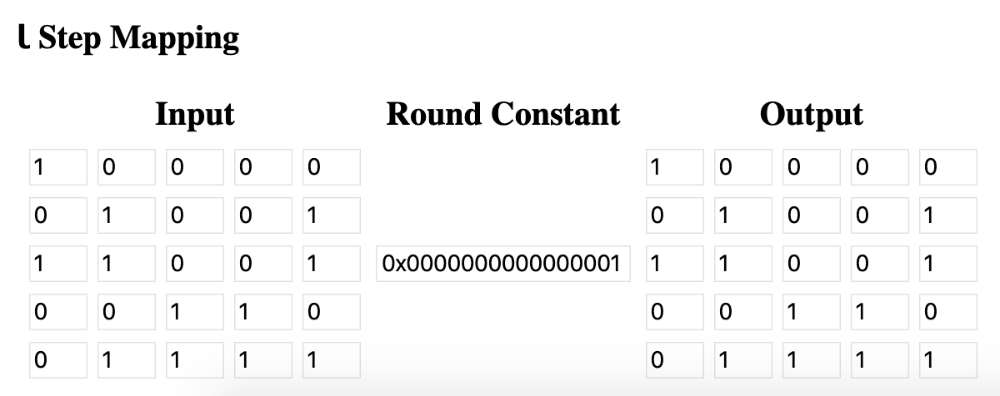
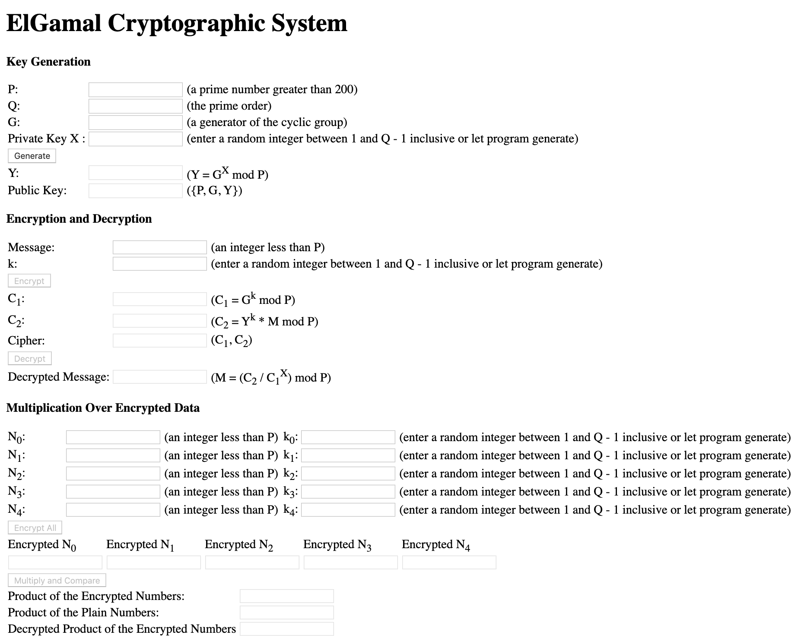
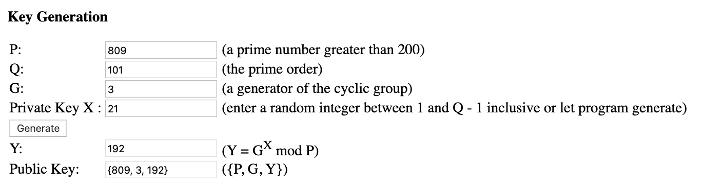
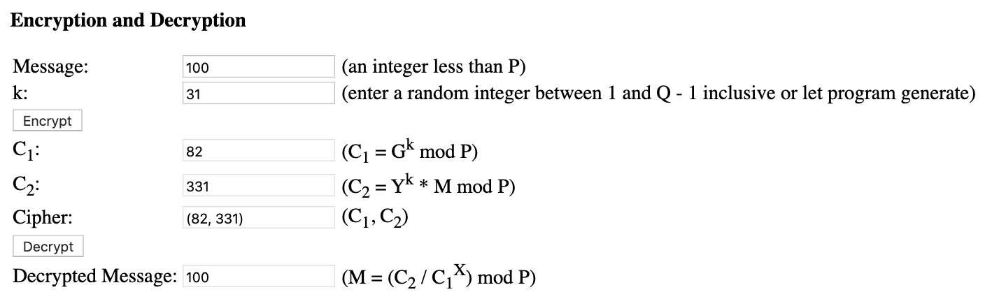
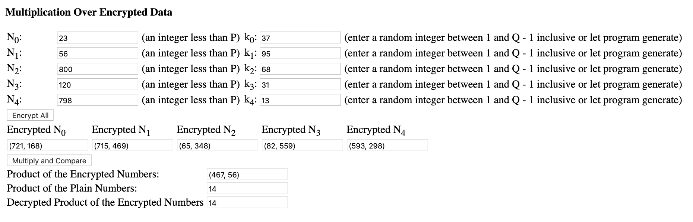

# Keccak And ElGamal
**by Jing Li s3676458**

## Introduction

This project creates demonstrations of SHA-3 hash algorithm and ElGamal cryptographic system. 

For the SHA-3, the project uses the simple Keccak f-25 with 12 rounds and for each round illustrates the inputs and outputs of the four round functions — Theta, Pi, Chi, and Iota.

The ElGamal part, it shows the generation of public and private key pair, the message encryption and decryption, and also the homomorphic property of the algorithm.

## Keccak f-25

### Overview

The user interface of the Keccak f-25 demo is as follows:

In the above image, the input is a 5 x 5 binary matrix (**Original Matrix**) and the final output is another 5 x 5 binary matrix (**Final Output**), which is the hashed value after 12 rounds of step mappings. Once the user clicks the **Run Next Round** button, it will take as input the output of the iota step from the last round, or the original input if it's the first round, and then run through four step mappings for substitution and permutation.

The state matrix can be represented as `A[x,y]` where `x` is the column and `y` is the row, and the origin `A[0,0]` is at the lower left corner. It's worth noting that for Keccak f-25, the state only has **one** slice, which means there is only one value on the `z` axis, thus we don't need to take `z` into account in the step mappings.

### Theta Step

In the Theta step, we first need to calculate the column parity `C[x]`for each column in the slice by **XOR'ing** all elements in column `x`.

In total, we have five values for the column parity `C[x]`. Then we need to apply the Theta effect for each column parity by **XOR'ing** its two adjacent bit values cycling from end to head, i.e., `D[x] = C[x-1] XOR C[x+1]`. In the end, another bitwise XOR operation needs to be performed to return the output of the Theta function — `A'[x,y] = A[x,y] XOR D[x]`.

### Pi Step

In the Pi step, which is a permutation step, the elements within the 5 x 5 matrix are moved so that the new `x` position equals the old `y` position, and the new `y` position is computed as `(2x + 3y) mod 5`. The result is as follows:

### Chi Step

Chi step is another substitution step, which updates the current bit value using the bit values of the next two positions on the same row, so that `A[x,y] = B[x,y] XOR ((B[x+1,y] XOR 1) ^ B[x+2,y])` as depicted in the following image:

### Iota Step

The last step of a round is to break up any symmetry introduced by other step functions as it **XOR's** the first element `A[0,0]` of the matrix and the first bit of the **round constant**. There are 12 different round constants for Keccak f-25.

Then the output of this step will be the input of the Theta function in the next round until it runs for 12 rounds. 

## ElGamal Cryptographic System

### Overview

The user interface of the ElGamal demo is as follows:

In the above image, there are three main parts — key generation, encryption and decryption, and multiplication over encrypted data. The program gives a simplified demonstration on how the ElGamal Cryptographic System works. Since this program is only for demonstration, the code should **never** be used in any production systems.

### Key Generation

Like any other public key crypto-systems, the first thing to do is key generation.

To generate the public key, the user first needs to pick a prime number `P` along with its prime order `Q`. Then the user needs to enter a generator of the cyclic group given the prime order `Q`. Private key `X` can be entered or it will be generated randomly by the program, and `X` has to be in the range of `[1, Q-1]`. After that, the user can click the **Generate** button to compute the public key. The parameter `Y` of the public key is calculated as shown in the above image. `P`, `G`, and `Y` together form the public key.

### Encryption and Decryption

To encrypt a message, the message has to be transformed into a number that's less than the prime number `P`, and a random number `k` within the range of `[1, Q-1]` also needs to be selected.

In the above image, the user enters a message `M` represented in decimal format and a `k` will be randomly generated if not entered. Once the **Encrypt** button is clicked. `C1` and `C1` will be computed with the public key using the formulas in the image. `C1` and `C1` together constitute the cipher text of the message `M`.

When the user clicks the **Decrypt** button, the cipher text will be decrypted with private key `X` using the formula shown in the image. We can confirm that the decrypted message is indeed the same as the original message.

### Multiplication Over Encrypted Data

ElGamal is homomorphic, which means we can perform calculations on the encrypted data and when decrypted, the result would be the same as if we were doing the calculations on the plain data.

To demonstrate this, the user can pick five messages in decimal format (`N0`, `N1`, ..., `N4`) and then the random number `k` will be generated for each of the message if not entered. Once the user clicks the **Encrypt All** button, the five messages will be encrypted using the same public key that's computed earlier. Then if the user clicks the **Multiply and Compare** button, the program will first multiply the five encrypted messages and decrypt the product of the multiplication with the private key `X`. Then the program will also computes the product of plain numbers of those five messages. In the end, it's clear to see in the above image that the product of the plain numbers and the decrypted product of the encrypted numbers are the same.

